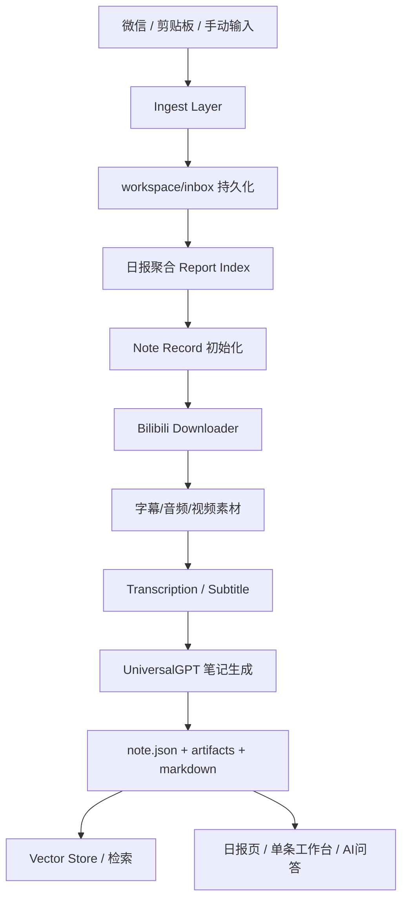

# LinkNote 企业级项目书

## 1. 项目概述

LinkNote 是一个本地优先（Local-first）的内容采集与知识整理系统，当前一期聚焦 Bilibili 视频链接场景，支持从微信文件传输助手、剪贴板、手动粘贴三类入口采集链接，并自动生成日报、单条笔记分析结果、思维导图、原文参考面板和 AI 问答工作台。

项目当前技术栈为：

- 后端：FastAPI
- 前端：React + Vite + TypeScript
- 模型接入：OpenAI Compatible Provider
- 转写能力：平台字幕优先，音频转写兜底
- 向量检索：ChromaDB（可选）
- 运行方式：Windows 本地部署，工作区文件持久化

项目定位不是“在线 SaaS 内容平台”，而是“个人/小团队内部可控的本地知识中台原型”。这一定位决定了它在架构上强调：

- 本地文件可追溯
- 配置透明可控
- 异常可恢复
- 任务可重跑
- 模型提供商可替换

## 2. 产品定位与业务价值

### 2.1 目标场景

- 从微信文件传输助手中持续收集 B 站视频链接
- 将零散链接自动整理为当天的日报待办清单
- 对单条视频生成结构化笔记，而不是只保存原链接
- 允许用户围绕单条笔记继续追问、复盘、导出与二次分析

### 2.2 业务价值

1. 将“链接收藏”升级为“知识资产沉淀”
2. 将“被动收集”升级为“主动整理与检索”
3. 将“单次总结”升级为“版本化笔记与可追问工作台”
4. 将“模型硬编码”升级为“多 Provider、多模型、可配置运行”

### 2.3 当前范围边界

- 当前一期仅支持 Bilibili
- 当前部署形态以单机本地使用为主
- 当前更偏向企业级工程化原型，而非多租户云原生平台

这不是缺点，而是清晰的产品边界控制。项目已经具备企业级工程骨架，但仍保留了可继续扩展到多平台、多用户、多任务中心的空间。

## 3. 核心能力总览

| 模块 | 用户价值 | 关键代码 | 实现说明 |
| --- | --- | --- | --- |
| 多源采集 | 自动收集 B 站链接 | `backend/app/routers/ingest.py` `backend/app/ingest/wechat.py` `backend/app/ingest/store.py` | 微信、剪贴板、手动输入统一落到 `workspace/inbox/{date}` |
| 日报聚合 | 形成当天可执行清单 | `backend/app/services/report_index.py` | 解析文本、抽取 URL、按 BVID/标准化 URL 去重、生成日报卡片 |
| 自动分析 | 将链接变成结构化笔记 | `backend/app/services/note_generation.py` `backend/app/downloaders/bilibili.py` | 拉取字幕/音频/视频，调用模型生成 Markdown 笔记 |
| 单条工作台 | 查看笔记、原文、导图、追问 | `frontend/src/pages/HomePage/components/MarkdownViewer.tsx` | 一个页面承载多视图切换和多面板协作 |
| AI 问答 | 基于笔记继续问答 | `backend/app/services/note_chat.py` `backend/app/services/note_chat_tools.py` | 先检索上下文，再允许模型按需调用 transcript / metadata / note 工具 |
| 调度发布 | 定时生成日报 | `backend/app/services/scheduler.py` `backend/app/services/daily_runner.py` | 定时触发采集、日报整理、批量分析与通知 |
| Provider 配置 | 支持多模型、多厂商 | `backend/app/services/provider_catalog.py` `backend/app/routers/settings.py` | Provider、模型、API Key、默认分析目标全部可配置 |
| 健康检查 | 启动前/运行中快速诊断 | `backend/app/services/diagnostics.py` | 检查前端构建、微信目录、模型目标、API Key、cookies 等 |
| 结果持久化 | 支持版本、追踪、重试 | `backend/app/services/note_records.py` | 每条 note 独立目录，保留 `note.json` 与 artifacts |

## 4. 总体架构设计

### 4.1 架构分层



### 4.2 前后端边界

后端负责：

- 配置加载
- 采集与落盘
- 日报构建
- 笔记分析
- 问答与检索
- 调度与通知

前端负责：

- 报表入口与交互动作
- 单条工作台展示
- 设置与健康诊断面板
- 用户级操作反馈

### 4.3 启动流程

`backend/app/main.py` 中的 `create_app()` 与 `lifespan()` 定义了应用启动主线：

1. 加载配置
2. 同步开机自启配置
3. 修复上次中断的运行态 note
4. 启动每日调度器
5. 挂载截图静态目录
6. 如前端已构建，则直接由 FastAPI 挂载前端产物

这意味着 LinkNote 在部署形态上是“单后端统一承载 API 与静态前端”，适合本地桌面式使用。

## 5. 核心功能与实现方式

## 5.1 多源链接采集

### 功能介绍

系统支持三种采集方式：

- 微信文件传输助手采集
- 剪贴板即时采集
- 手动粘贴链接入库

前端入口主要位于：

- `frontend/src/pages/ReportPage/DailyReport.tsx`
- `frontend/src/app/App.tsx`

后端接口主要位于：

- `POST /api/ingest/clipboard`
- `POST /api/ingest/manual`
- `POST /api/ingest/wechat`
- `POST /api/ingest/wechat/refresh`
- `GET /api/ingest/wechat/sessions`

### 实现方式

`backend/app/routers/ingest.py` 负责将三类入口统一封装成 API。

核心思路不是“直接把采集结果写进数据库”，而是先写入标准化文本文件：

- 路径：`workspace/inbox/{yyyy-mm-dd}`
- 文件命名：`HHMMSS-source-name.txt`
- 存储逻辑：`backend/app/ingest/store.py::store_text_input`

这样设计的优点是：

- 输入原始事实可追溯
- 便于排查采集问题
- 报表生成与采集行为解耦

### 微信采集代码逻辑

关键文件：`backend/app/ingest/wechat.py`

核心实现逻辑：

1. 校验微信采集是否启用
2. 尝试刷新已导出的微信工作目录
3. 复制微信数据库快照，避免直接操作活跃数据库
4. 根据历史扫描状态计算本次增量扫描起点
5. 枚举最近会话，并按 allowlist / 时间窗口过滤
6. 读取每个会话对应的消息表，抽取消息中的 URL
7. 组装为标准文本行，如 `[时间] 会话标题: 预览内容`
8. 去重后写入当日 inbox 文本文件
9. 保存本次最大扫描时间戳，支持下次增量继续

可概括为：

```text
collect_wechat_messages
-> copy snapshot
-> resolve since_ts
-> list_recent_wechat_sessions
-> read Msg_xxx tables
-> extract urls
-> dedupe lines
-> store_text_input
-> save scan state
```

这是一个典型的企业级采集实现：以“快照 + 增量状态 + 原始文本落盘”替代“实时直连 + 单次查询”，鲁棒性更高。

## 5.2 日报聚合与去重

### 功能介绍

日报页是项目的主入口。用户看到的不是原始文件，而是“当天待整理链接卡片流”。

关键文件：

- `backend/app/services/report_index.py`
- `frontend/src/pages/ReportPage/DailyReport.tsx`

### 实现方式

`build_daily_report()` 会扫描当天 inbox 中的所有 `.txt` 文件，并逐行处理：

1. 用正则抽取 URL
2. 优先从 URL 中提取 BVID
3. 如果有 BVID，则用 `bvid:{BVID}` 作为去重键
4. 否则对 URL 做规范化，去掉分享追踪参数后再作为去重键
5. 生成稳定 `item_id`
6. 结合已有 note 记录判断状态：`pending / running / completed / failed`
7. 汇总成日报对象返回前端

这里最关键的企业级做法有两个：

- 去重不是基于“整行文本”，而是基于“业务主键（BVID）+ 规范 URL”
- 日报是“动态索引视图”，不是单独维护一份易过期的日报数据库

因此，日报天然具备可重建能力。

## 5.3 单条笔记分析链路

### 功能介绍

单条笔记分析是 LinkNote 的核心价值所在。它把一条视频链接变成：

- 视频元数据
- 原始字幕或转写结果
- Markdown 笔记
- 多版本分析结果
- 可导出的标准文本产物

关键文件：

- `backend/app/services/note_generation.py`
- `backend/app/downloaders/bilibili.py`
- `backend/app/transcription/service.py`
- `backend/app/analysis/universal_gpt.py`
- `backend/app/analysis/prompt_builder.py`
- `backend/app/services/note_result_export.py`

### 代码实现主流程

核心入口是 `backend/app/services/note_generation.py::run_note_analysis`

处理顺序如下：

```text
run_note_analysis
-> 标记 note 为 running
-> _analyze_bilibili_note
   -> resolve_analysis_target
   -> resolve_provider_api_key
   -> BilibiliDownloader.fetch_subtitles
   -> BilibiliDownloader.fetch_media
   -> transcribe_audio (字幕缺失时兜底)
   -> UniversalGPT.summarize
   -> markdown 后处理（链接/截图）
   -> write artifacts
-> append_note_version
-> index vector store
-> cleanup intermediate files
```

### Bilibili 下载实现逻辑

`backend/app/downloaders/bilibili.py` 的职责不是单纯下载文件，而是对“不同可用素材来源”做统一封装：

- 优先尝试平台字幕
- 字幕不可用时下载音频进行转写
- 开启截图时额外下载视频文件
- 对短链做解析
- 支持 cookies 文件与浏览器 cookies fallback

这让系统具备了较强的业务容错能力：

- 能拿到字幕就省成本
- 拿不到字幕还能做转写
- 遇到受限视频还能走 cookies 兜底

### 转写实现逻辑

`backend/app/transcription/service.py::transcribe_audio` 根据配置分流：

- `faster_whisper` 走本地转写
- `openai_compatible` 走模型接口转写

这是一种典型的策略模式实现，转写能力没有写死在下载器里。

### 大模型生成逻辑

`backend/app/analysis/universal_gpt.py::UniversalGPT` 负责真正的笔记生成。

其核心能力包括：

- 将 transcript segment 组装为 prompt
- 根据请求大小自动分块
- 对长文本分段总结后再 merge
- 通过 checkpoint 文件保存中间进度
- 对 429/5xx/timeout 做自动重试

`backend/app/analysis/prompt_builder.py` 则把“格式要求”和“风格要求”拼进基础提示词中，例如：

- 是否生成目录
- 是否生成原片跳转标记
- 是否插入截图标记
- 输出风格是详细、教程、商业汇报还是会议纪要

这使得 LinkNote 的分析结果不是固定模板，而是“可配置的内容生产引擎”。

### 结果持久化逻辑

分析完成后，系统会同时写入：

- `note.json`：单条笔记的主记录
- `artifacts/media.json`：视频元数据
- `artifacts/transcript.json`：转录结果
- `artifacts/analysis.md`：分析输出
- `artifacts/{item_id}.json`：BiliNote 兼容 note_result 快照

关键代码：

- `backend/app/services/note_records.py`
- `backend/app/services/note_result_export.py`

这套产物结构很适合企业内交付，因为：

- 主记录清晰
- 中间产物可复查
- 检索与展示可复用

## 5.4 Markdown、截图、原片跳转

### 功能介绍

LinkNote 输出的不是纯文字摘要，而是可跳转、可插图、可导出的结构化 Markdown。

关键文件：`backend/app/services/note_markdown.py`

### 实现逻辑

`_post_process_markdown()` 负责二次加工模型结果：

1. 如启用截图，则查找 `*Screenshot-[mm:ss]` 标记
2. 使用 ffmpeg 在对应时间点截帧
3. 将标记替换为图片链接
4. 将 `*Content-[mm:ss]` 标记替换成原片时间跳转链接
5. 在文首补充来源链接

这代表项目并没有把“视频理解”完全交给模型文本输出，而是做了工程级后处理增强，提升最终可读性与可验证性。

## 5.5 单条笔记工作台

### 功能介绍

单条工作台是项目体验最完整的区域，包含：

- 视频 Banner
- Markdown 笔记预览
- 原文转录参考面板
- 思维导图模式
- AI 问答面板
- 多版本切换
- 失败重试与导出

关键前端文件：

- `frontend/src/pages/NotePage/Detail.tsx`
- `frontend/src/pages/HomePage/components/MarkdownViewer.tsx`
- `frontend/src/app/TranscriptPanel.tsx`
- `frontend/src/app/NoteChatPanel.tsx`
- `frontend/src/app/MarkmapView.tsx`

### 实现方式

`MarkdownViewer.tsx` 是单条工作台的状态编排中心，负责：

- 根据加载态、失败态、成功态切换界面
- 控制 Markdown / Mindmap 模式
- 控制原文参考面板显示
- 控制 AI Chat 半屏 / 全屏模式
- 切换分析版本
- 触发重分析和导出

这说明前端不是简单做一个“结果展示页”，而是做了完整的“知识处理工作台”。

## 5.6 AI 问答与检索增强

### 功能介绍

AI 问答不是直接把整篇笔记丢给模型，而是先检索，再回答，必要时再触发工具调用。

关键文件：

- `backend/app/services/note_chat.py`
- `backend/app/services/note_chat_tools.py`
- `backend/app/services/note_retrieval.py`
- `backend/app/services/vector_store.py`

### 实现方式

#### 第一步：构建上下文

`answer_note_question()` 先调用 `_build_chat_context()`：

- 如果 ChromaDB 可用，则优先走向量检索
- 如无向量能力，则退化为本地 chunk 检索

检索对象分三类：

- meta：视频元信息
- markdown：笔记分段
- transcript：转录窗口片段

`note_retrieval.py` 会为每个 chunk 生成：

- 文本内容
- 来源类型
- section title
- 原片 jump_url

因此前端在展示回答时，可以把“答案”与“证据来源”一起显示。

#### 第二步：工具调用问答

`note_chat_tools.py` 暴露了 3 个工具：

- `lookup_transcript`
- `get_video_info`
- `get_note_content`

`note_chat.py::_chat_with_tools()` 会：

1. 先发起支持 tools 的对话请求
2. 如果模型返回 tool calls，则执行对应工具
3. 把工具结果再喂回模型继续推理
4. 如果 provider 不支持 tools，则自动降级为普通聊天

这一层设计很有价值，因为它把问答从“静态 RAG”升级成了“检索 + 结构化工具增强”的模式。

## 5.7 每日调度、通知与保活

### 功能介绍

LinkNote 支持手动触发和定时触发两种日报整理方式。

关键文件：

- `backend/app/routers/daily.py`
- `backend/app/services/daily_runner.py`
- `backend/app/services/scheduler.py`
- `backend/app/services/notifications.py`

### 实现逻辑

`manual_run_daily()` / `scheduled_run_daily()` 最终都会进入 `_run_daily()`：

1. 通过 `_RUN_LOCK` 保证同一时刻只有一个日报任务在执行
2. 先采集微信与剪贴板数据
3. 生成日报
4. 逐条处理 `pending` 项
5. 调用 `run_note_analysis()` 完成批量分析
6. 保存运行状态
7. 执行保留策略清理
8. 发送 Windows 通知

通知实现位于 `notifications.py`，通过 PowerShell 调起系统托盘气泡，并允许点击直达当前日报页。

这说明项目不仅关注“分析成功”，还关注“任务编排”和“用户回路闭环”。

## 5.8 设置中心、Provider 管理与健康诊断

### 功能介绍

设置页覆盖了：

- 分析风格与格式
- Provider / Model 配置
- 转写配置
- B 站下载配置
- 微信采集配置
- 调度与通知配置
- 监控与健康检查

关键文件：

- `backend/app/routers/settings.py`
- `backend/app/services/provider_catalog.py`
- `backend/app/services/diagnostics.py`
- `frontend/src/app/App.tsx`

### 实现逻辑

#### 配置模型

`backend/app/config/settings.py` 用 dataclass 明确定义了：

- `WeChatConfig`
- `ScheduleConfig`
- `ModelProviderConfig`
- `AnalysisConfig`
- `AppConfig`

这使得配置不是零散 JSON，而是具备明确领域边界的结构化配置。

#### Provider 管理

`provider_catalog.py` 负责：

- 新增 Provider
- 更新 Provider
- 拉取远端模型列表
- 启用/删除模型
- 校验分析目标是否合法

其中 `resolve_analysis_target()` 的约束很明确：

- 必须选定 provider
- provider 必须启用
- 必须选定 model
- model 必须在启用列表里

这避免了很多“默认兜底导致实际跑错模型”的企业项目常见问题。

#### 健康检查

`diagnostics.py::collect_health_bootstrap()` 会返回一组前端可直接消费的健康检查项：

- 前端构建产物是否存在
- 微信目录是否可用
- 当前分析目标是否有效
- API Key 是否存在
- Provider 鉴权是否通过
- Bilibili cookies 是否可用

这不是简单的 `/health=ok`，而是面向实际使用障碍的“启动诊断系统”。

## 6. 工程经验与企业级设计亮点

### 6.1 本地优先而不是数据库优先

项目大量使用 `workspace` 文件结构来承载原始输入、运行状态和分析产物，而不是一开始就引入重数据库。

优点：

- 易调试
- 易迁移
- 易恢复
- 易审计

### 6.2 原始输入与衍生结果分层存储

项目把：

- inbox 原始采集
- note 主记录
- artifacts 中间产物
- vector index 检索索引

明确分层。这样后续无论接入数据库、对象存储，还是构建任务中心，都不会推翻现有结构。

### 6.3 明确的失败分类机制

`note_generation.py::_classify_analysis_error()` 对常见问题做了结构化归类，例如：

- API Key 缺失
- API Key 无效
- Provider 缺失
- Model 缺失
- cookies 缺失
- ffmpeg/yt-dlp 缺失
- URL 非法

这使前端可以展示可执行的错误提示，而不是只显示原始异常。

### 6.4 长文本任务的断点续跑能力

`UniversalGPT` 使用 checkpoint 保存 summarize/merge 阶段的 partials，避免长任务失败后完全从头开始。

这是一项很典型的企业级稳定性设计。

### 6.5 兼容真实运行环境的降级策略

项目中多处实现了降级：

- 字幕优先，音频转写兜底
- cookies 文件优先，浏览器 cookies 兜底
- 向量检索可用时用向量，不可用时走本地 chunk 检索
- tools 不支持时自动退回普通 chat

这类设计比“理想路径跑通”更接近真实生产环境。

### 6.6 中断恢复机制

`note_records.py::reconcile_interrupted_running_notes()` 会在服务启动时扫描上次处于 `running` 的 note，并恢复成可解释状态，避免前端永远看到“分析中”假状态。

这体现了系统对异常退出场景的考虑。

## 7. 代码级功能映射清单

| 功能 | 后端入口 | 核心服务 | 前端页面/组件 |
| --- | --- | --- | --- |
| 微信采集 | `routers/ingest.py::ingest_wechat` | `ingest/wechat.py::collect_wechat_messages` | `pages/ReportPage/DailyReport.tsx` |
| 剪贴板采集 | `routers/ingest.py::ingest_clipboard` | `ingest/clipboard.py::collect_clipboard` | `pages/ReportPage/DailyReport.tsx` |
| 手动补录 | `routers/ingest.py::ingest_manual` | `ingest/store.py::store_text_input` | `pages/ReportPage/DailyReport.tsx` |
| 日报生成 | `routers/reports.py::today_report` | `services/report_index.py::build_daily_report` | `pages/ReportPage/DailyReport.tsx` |
| 立即整理 | `routers/daily.py::run_daily_now` | `services/daily_runner.py::_run_daily` | `src/app/App.tsx` |
| 单条分析 | `routers/reports.py::analyze_note` | `services/note_generation.py::run_note_analysis` | `pages/HomePage/components/MarkdownViewer.tsx` |
| 重分析 | `routers/reports.py::reanalyze_note` | `services/note_generation.py::run_note_analysis` | `pages/HomePage/components/MarkdownViewer.tsx` |
| 导出 Markdown | `routers/reports.py::export_note_markdown` | `services/note_records.py` | `pages/HomePage/components/MarkdownViewer.tsx` |
| AI 问答 | `routers/reports.py::note_chat` | `services/note_chat.py::answer_note_question` | `app/NoteChatPanel.tsx` |
| 原文参考 | `routers/reports.py::note_detail` | `services/report_index.py::note_detail_stub` | `app/TranscriptPanel.tsx` |
| Provider 管理 | `routers/providers.py` `routers/models.py` | `services/provider_catalog.py` | `src/app/App.tsx` + 设置页 |
| 健康检查 | `routers/health.py::health_bootstrap` | `services/diagnostics.py::collect_health_bootstrap` | 设置页 Monitor |

## 8. 当前项目成熟度评估

### 已具备的企业级特征

- 模块边界清晰
- 配置可视化、可持久化
- 任务有状态、可恢复、可诊断
- 模型接入解耦
- 错误分类明确
- 前后端职责分离
- 本地产物可审计

### 当前仍可继续演进的方向

1. 增加数据库索引层，提升跨日期、跨来源查询能力
2. 引入任务队列，支持更强的并发和重试治理
3. 支持更多视频平台
4. 增加用户体系、权限体系和团队协作能力
5. 增加日志中心与运行指标监控

## 9. 结论

LinkNote 当前已经不是一个“简单的视频摘要工具”，而是一个具备企业级工程骨架的本地知识处理系统原型。

它的核心竞争力不在于“能调用模型”，而在于它把以下能力完整串了起来：

- 多源采集
- 日报索引
- 单条分析
- 版本化结果
- 检索增强问答
- 调度发布
- 健康诊断
- 可配置模型治理

从代码实现上看，项目已经具备继续向“内容知识中台”演进的基础。如果后续补足数据库、任务队列、多租户和权限模型，完全可以继续向更标准的企业级内部知识平台升级。
