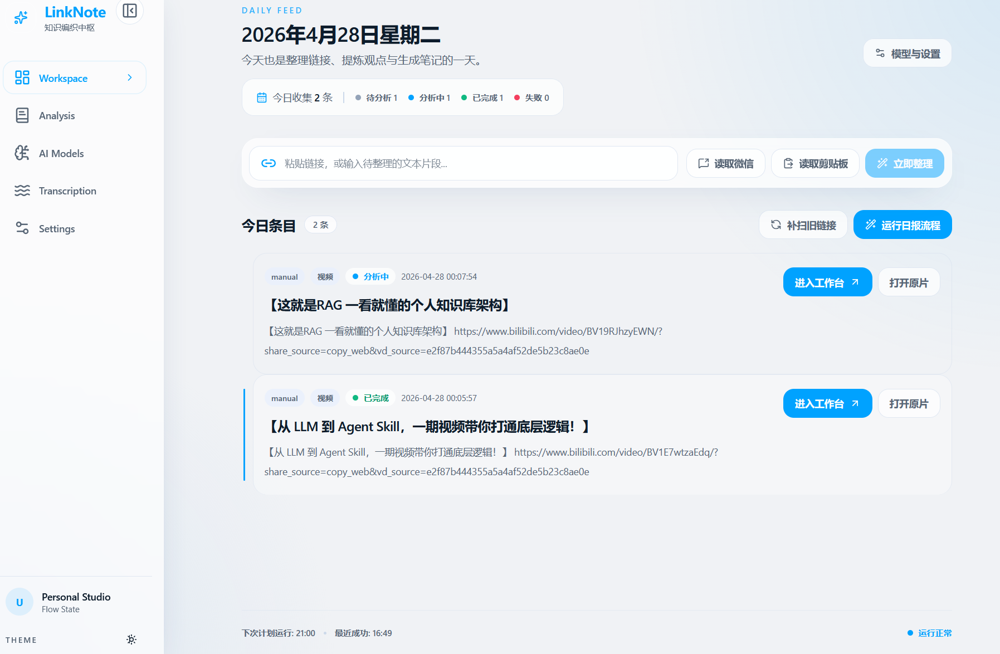
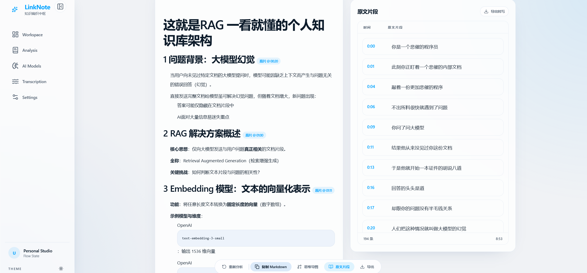

# linknote项目前端更新

优化工作流，目标是解决 codex 写的前端卡片流堆积的问题，让界面更有活力。

Google Stitch 出 `design.md` 文件后与 AI 进行微调，并完成后端联调。这里也附上收集到的一些 vibe 前端参考网站。

网站基本都在这里了：

- Google Stitch: https://stitch.withgoogle.com/
- Stitch MCP: https://stitch.withgoogle.com/docs/mcp/setup/
- Stitch Skills: https://github.com/google-labs-code/stitch-skills
- impeccable: https://impeccable.style/
- skills.sh: https://skills.sh/
- React Bits: https://reactbits.dev/
- 网站参考: https://godly.website/
- 提示词大全: https://uiprompt.art/
- 提示词大全: https://www.uiprompt.site/zh
- 提示词大全: https://www.stylekit.top/zh/styles
- 提示词大全: https://www.designprompts.dev/
- shadcn/ui: https://ui.shadcn.com/
- tweakcn: https://tweakcn.com/

更改色调，替换卡片流为多元素 UI 按钮。

单条分析页：

下方做悬浮按钮，侧边栏做可隐藏处理，文本做自动适配，遇到文字后可以按尺寸变化。

问题：

- 思维导图无法导出
- 思维导图目前的阅读效果感觉较差

后续开发：

1. 适配更多平台
2. 提升分析质量和转写质量
3. 数据库，建立本地知识库
